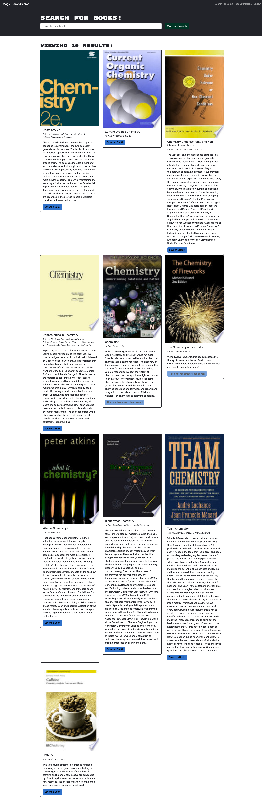

# Book Search Engine using MERN

## Description
As a web developer it is imperative to satisfy front end and back end demands of user clients. Data is a key driver of web development and the ability to personalize user data forms the bedrock of real-world web development today and applications need to keep up with growing trends. 

This project focuses on meeting those demands by building a fully functioning [Google Books API](https://developers.google.com/books) search engine with RESTful API. Utilities used include [GraphQL API](https://graphql.org) built with [Apollo Server](https://www.apollographql.com/docs/apollo-server/); MERN stack with a [React](https://react.dev) frontend, [MongoDB](https://www.mongodb.com) database, and [Node.js](https://nodejs.org/en)/[Express.js](https://expressjs.com) server and API. Applciation was deployed to [Heroku](https://www.heroku.com) with a [MongoDB](https://www.mongodb.com) database using [MongoDB Atlas](https://www.mongodb.com/atlas/database).

## Table of Contents
- [User Story](#UserStory)
- [Acceptance Criteria](#AcceptanceCriteria)
- [Appearance and Functionality](#Appearance&Functionality)
- [Questions](#questions)
- [Credits](#Credits)

## User Story

```md
AS AN avid reader
I WANT to search for new books to read
SO THAT I can keep a list of books to purchase
```

## Acceptance Criteria

```md
GIVEN a book search engine
WHEN I load the search engine
THEN I am presented with a menu with the options Search for Books and Login/Signup and an input field to search for books and a submit button
WHEN I click on the Search for Books menu option
THEN I am presented with an input field to search for books and a submit button
WHEN I am not logged in and enter a search term in the input field and click the submit button
THEN I am presented with several search results, each featuring a book’s title, author, description, image, and a link to that book on the Google Books site
WHEN I click on the Login/Signup menu option
THEN a modal appears on the screen with a toggle between the option to log in or sign up
WHEN the toggle is set to Signup
THEN I am presented with three inputs for a username, an email address, and a password, and a signup button
WHEN the toggle is set to Login
THEN I am presented with two inputs for an email address and a password and login button
WHEN I enter a valid email address and create a password and click on the signup button
THEN my user account is created and I am logged in to the site
WHEN I enter my account’s email address and password and click on the login button
THEN I the modal closes and I am logged in to the site
WHEN I am logged in to the site
THEN the menu options change to Search for Books, an option to see my saved books, and Logout
WHEN I am logged in and enter a search term in the input field and click the submit button
THEN I am presented with several search results, each featuring a book’s title, author, description, image, and a link to that book on the Google Books site and a button to save a book to my account
WHEN I click on the Save button on a book
THEN that book’s information is saved to my account
WHEN I click on the option to see my saved books
THEN I am presented with all of the books I have saved to my account, each featuring the book’s title, author, description, image, and a link to that book on the Google Books site and a button to remove a book from my account
WHEN I click on the Remove button on a book
THEN that book is deleted from my saved books list
WHEN I click on the Logout button
THEN I am logged out of the site and presented with a menu with the options Search for Books and Login/Signup and an input field to search for books and a submit button  
```

## Appearance and Functionality 



## Questions
For any questions or suggestions, feel free to reach out to me on GitHub: [StanOp09](https://github.com/StanOp09) or via email: stanleykaopare@gmail.com.

## Credits
- Sean Roshan
- [Google Books API](https://developers.google.com/books)
- [GraphQL API](https://graphql.org)
- [Apollo Server](https://www.apollographql.com/docs/apollo-server/)
- [React](https://react.dev)
- [MongoDB](https://www.mongodb.com)
- [MongoDB Atlas](https://www.mongodb.com/atlas/database)
- [Node.js](https://nodejs.org/en)
- [Express.js](https://expressjs.com)
- [Heroku](https://www.heroku.com)